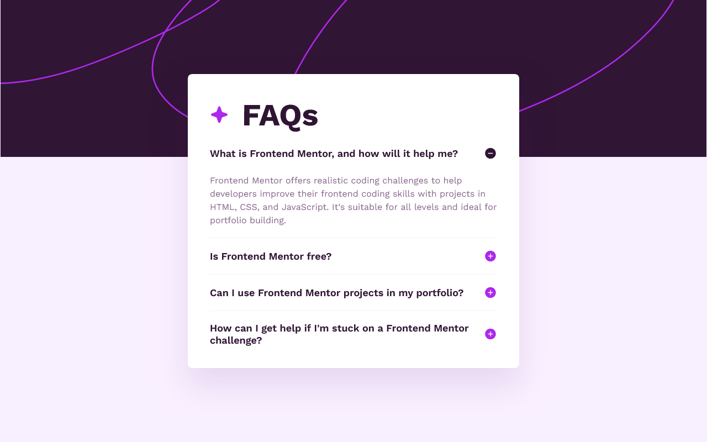
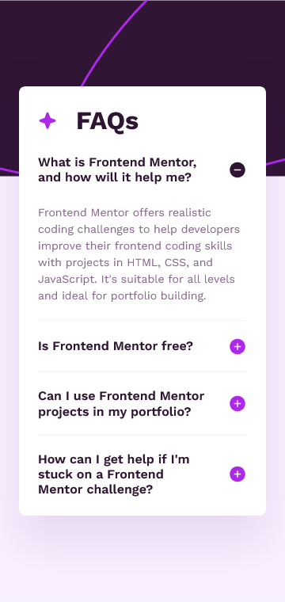

# Frontend Mentor - FAQ accordion solution

This is a solution to the [FAQ accordion challenge on Frontend Mentor](https://www.frontendmentor.io/challenges/faq-accordion-wyfFdeBwBz). Frontend Mentor challenges help you improve your coding skills by building realistic projects.

## Table of contents

- [Overview](#overview)
  - [The challenge](#the-challenge)
  - [Screenshot](#screenshot)
  - [Links](#links)
- [My process](#my-process)
  - [Built with](#built-with)
  - [What I learned](#what-i-learned)
- [Author](#author)
- [Contribution](#contribution)

## Overview

### The challenge

Users should be able to:

- Hide/Show the answer to a question when the question is clicked
- Navigate the questions and hide/show answers using keyboard navigation alone
- View the optimal layout for the interface depending on their device's screen size
- See hover and focus states for all interactive elements on the page

### Screenshot





### Links

- Solution URL: [Go to solution](https://www.frontendmentor.io/solutions/github-user-search-app-vue3---typescript---scss-63J0Il57ZL)
- Live Site URL: [Go to live site](https://github-user-search-app-acdev.vercel.app/)

## My process

### Built with

- Semantic HTML5 markup
- CSS / SCSS
- Flexbox
- CSS Grid
- Mobile-first workflow
- [Vue3](https://vuejs.org/) - The Progressive JavaScript Framework
- [Typescript](https://www.typescriptlang.org/) - Strongly typed JS
- [Vitest](https://vitest.dev/) - Next Generation Testing Framework

### What I learned

#### Vitest - @vue/test-utils

```ts
describe('AccordionCard', () => {
  it('renders the component properly', () => {
    const wrapper = mount(AccordionCard);
    const title = wrapper.find('.accordion-header__title');
    const items = wrapper.findAll('.accordion-item');
    expect(title.text()).toBe('FAQs');
    expect(items).toHaveLength(accordionItems.length);
  });
});
```

## Author

- Frontend Mentor - [@AntoineC-dev](https://www.frontendmentor.io/profile/AntoineC-dev)

## Contribution

You can use this project for whatever you want. Don't forget to leave a ⭐.

- Fork the project to add it to your githug repositories.
- Clone it on your local machine from you repositories.
- cd into the project in your terminal
- Install all the dependencies by running `npm install` or `yarn install` or `pnpm install`.
- Open the project in your editor and start coding by running `npm run dev` or `yarn dev` or `pnpm dev`.
